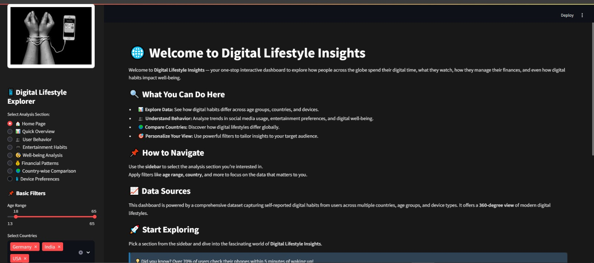
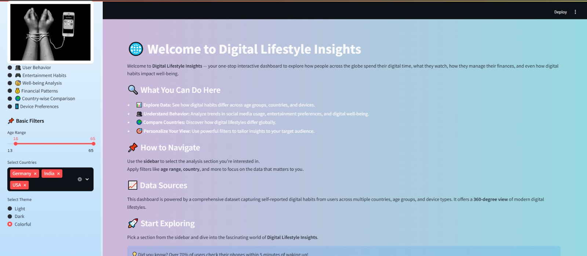
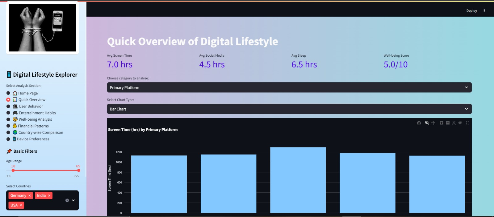
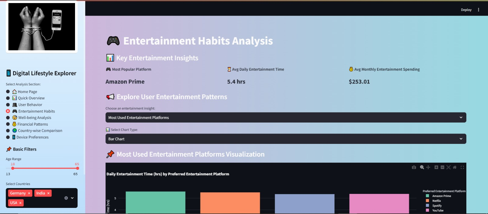
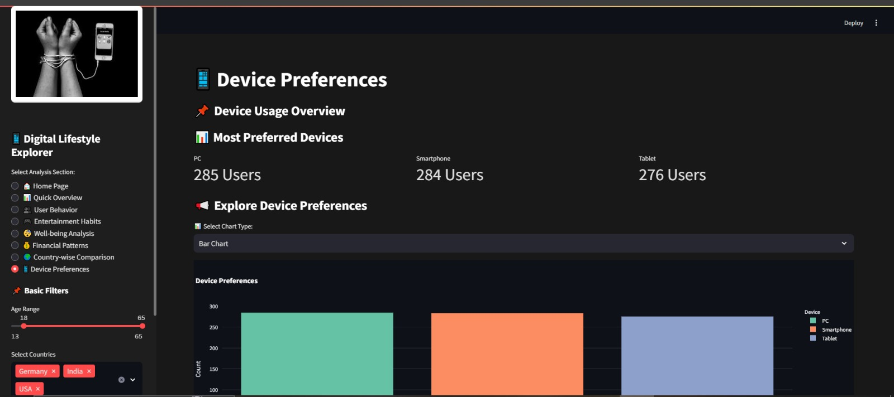
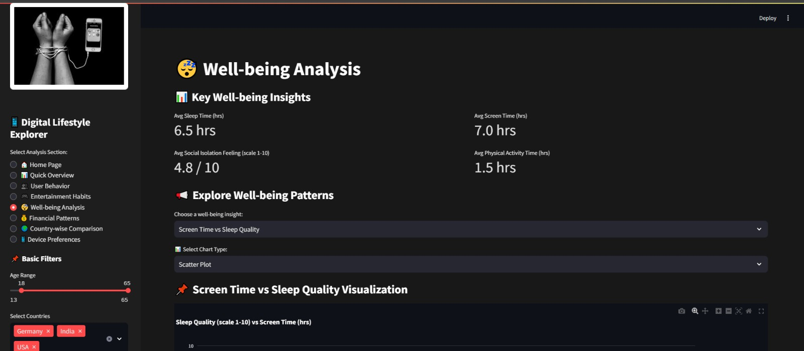

# 📊 Social Media & Entertainment Data Analysis Dashboard

An interactive dashboard built to analyze user behavior around social media and entertainment consumption — including screen time, social media fatigue, and entertainment spending patterns.

---

## ✨ Features

- 📈 Interactive data visualizations for user behavior trends
- ⏱️ Screen time analysis across platforms
- 😩 Social media fatigue insights
- 💰 Entertainment spending breakdown
- 🧹 Cleaned and preprocessed real-world dataset

---

## 🛠️ Tech Stack

- **Python**
- **Pandas** & **NumPy** — data cleaning and analysis
- **Streamlit** — interactive dashboard interface
- **Jupyter Notebook** — exploratory data analysis

---

## 📂 Project Structure

```
├── datasets/                  # Raw and supporting data files
├── filter_dataset_modi.csv    # Cleaned/filtered dataset
├── social.py                  # Main dashboard application
├── social_DB.py                # Database handling logic
├── socialmedia.ipynb          # Exploratory data analysis notebook
└── README.md
```

---

## 🚀 How to Run

1. Clone this repository
```bash
git clone https://github.com/SyedAliHassan1272/social-media-entertainment-dashboard.git
cd social-media-entertainment-dashboard
```

2. Install the required libraries
```bash
pip install pandas numpy streamlit
```

3. Run the dashboard
```bash
streamlit run social.py
```

---

## 📸 Preview

<p align="center">
  
</p>

<p align="center">
  
</p>

<p align="center">
  
</p>

<p align="center">
  
</p>

<p align="center">
  
</p>

<p align="center">
  
</p>

---

## 👤 Author

**Sayed Ali Hassan Naqvi**
📧 syedalihassann081@gmail.com
🔗 [LinkedIn](https://linkedin.com/in/sayed-alihassan-naqvi)
